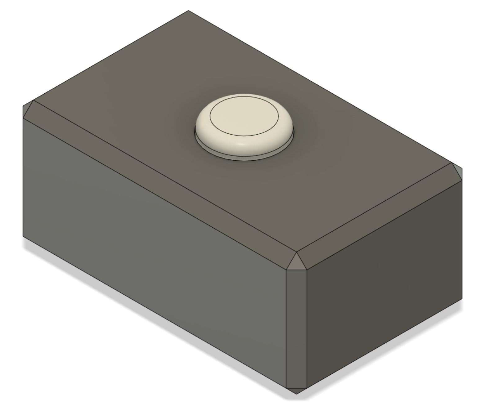
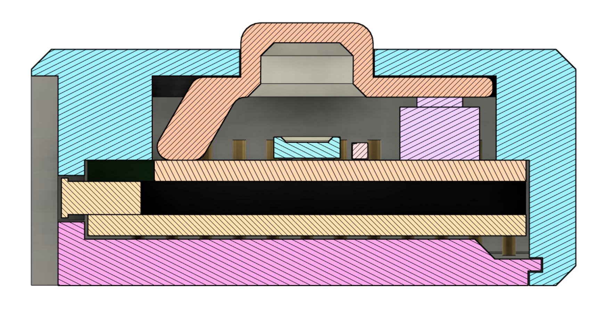

# MicroMouseJiggler
Arduino Pro Micro based mouse jiggler.

It's simple.

It has a button.
You push the button, it starts periodically jiggling your mouse cursor.
You push the button again, it stops jiggling your mouse cursor.

The button glows green when active, and flashes when moving the cursor.
If it's not active, the button glows red, but turns off after a minute.

The PCB is designed to be soldered on top of an Arduino Pro Micro.
To have an easy illuminated button, the lever is illuminated from below by a neopixel LED.

All pieces are designed with 3D printing in mind, but the tolerances are chosen very low for a good fit.

CAD source: https://a360.co/3dbTGTp